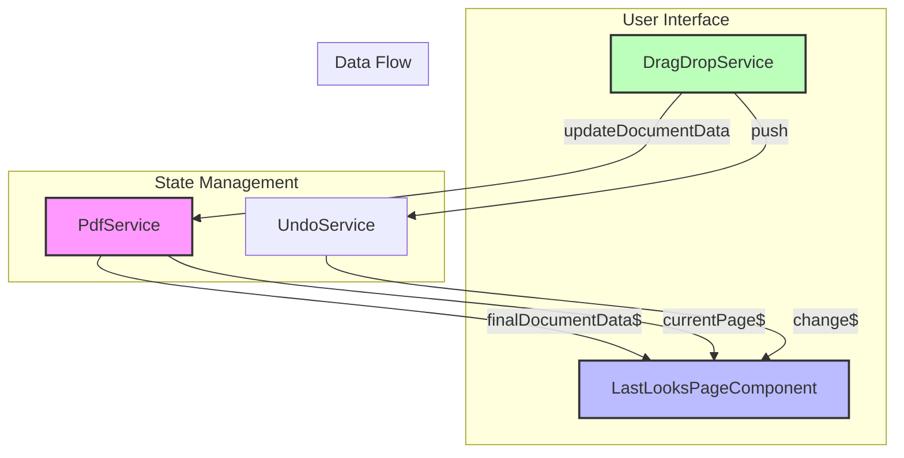

# Document Update Flow in SidesWays

## Overview
This document illustrates how updates flow through the SidesWays application, particularly focusing on the interaction between drag operations, the PDF service, and the LastLooks component.

## Architecture



## Update Process

### 1. Drag Operation Initiation
When a user performs a drag operation:

```typescript
// In DragDropService
updateComponent(line: Line) {
  if (this.pdf.finalDocument?.data) {
    const currentPage = this.pdf.finalDocument.data[this.indexOfLineToUpdate];
    if (currentPage) {
      const lineIndex = currentPage.findIndex(l => l.index === line.index);
      if (lineIndex !== -1) {
        // Update the line in the current page
        currentPage[lineIndex] = { ...line };
        
        // Update the document in PdfService
        this.pdf.finalDocument.data[this.indexOfLineToUpdate] = [...currentPage];
        
        // Update through single source of truth
        this.pdf.updateDocumentData(this.pdf.finalDocument.data);
      }
    }
  }
}
```

### 2. PDF Service State Update
The PdfService acts as the single source of truth:

```typescript
// In PdfService
updateDocumentData(data: any[]): void {
  this.finalDocument.data = data;
  this._finalDocumentData$.next(data);
}
```

### 3. Component Update
LastLooksPageComponent subscribes to PDF service updates:

```typescript
// In LastLooksPageComponent
ngOnInit(): void {
  // Subscribe to document-wide updates
  this.finalDocumentDataSubscription = this.pdf.finalDocumentData$.subscribe(data => {
    if (data && data[this.currentPageIndex]) {
      this.page = [...data[this.currentPageIndex]];
      this.cdRef.detectChanges();
    }
  });

  // Subscribe to current page updates
  this.pdf.currentPage$.subscribe(currentPage => {
    if (currentPage && this.currentPageIndex === this.pdf.getCurrentPageIndex()) {
      this.page = [...currentPage];
      this.cdRef.detectChanges();
    }
  });
}
```

## Key Principles

1. **Single Source of Truth**
   - PdfService maintains the document state
   - All updates flow through `updateDocumentData()`
   - Components subscribe to PdfService observables

2. **Unidirectional Data Flow**
   - User actions → DragDropService
   - DragDropService → PdfService
   - PdfService → Components

3. **State Management**
   - Document state is managed by PdfService
   - UndoService tracks changes for undo operations
   - Components reflect state but don't manage it

## Benefits

1. **Predictable Updates**
   - Clear path for data flow
   - Single source of truth
   - Consistent state across components

2. **Maintainable Code**
   - Clear separation of concerns
   - Easy to debug state issues
   - Simple to add new features

3. **Performance**
   - Minimal state duplication
   - Efficient change detection
   - Optimized rendering

## Common Operations

### Drag and Drop
1. User drags a line
2. DragDropService updates position
3. PdfService receives update
4. Components reflect change

### Undo/Redo
1. User triggers undo
2. UndoService retrieves last change
3. PdfService applies change
4. Components update

### Scene Reordering
1. User reorders scenes
2. PdfService updates document structure
3. Components reflect new order

## Best Practices

1. Always update through PdfService
2. Subscribe to appropriate observables
3. Use change detection strategically
4. Maintain unidirectional data flow
5. Keep components focused on presentation 