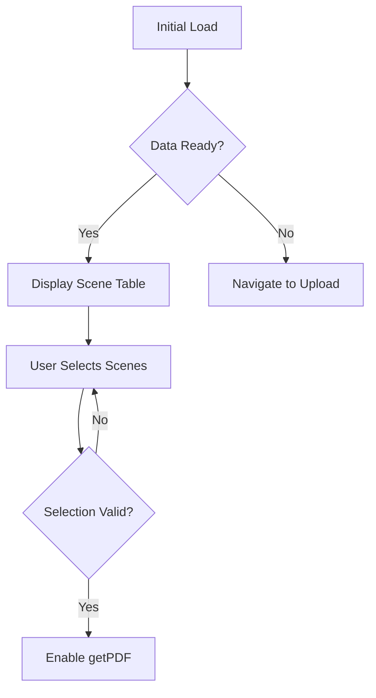
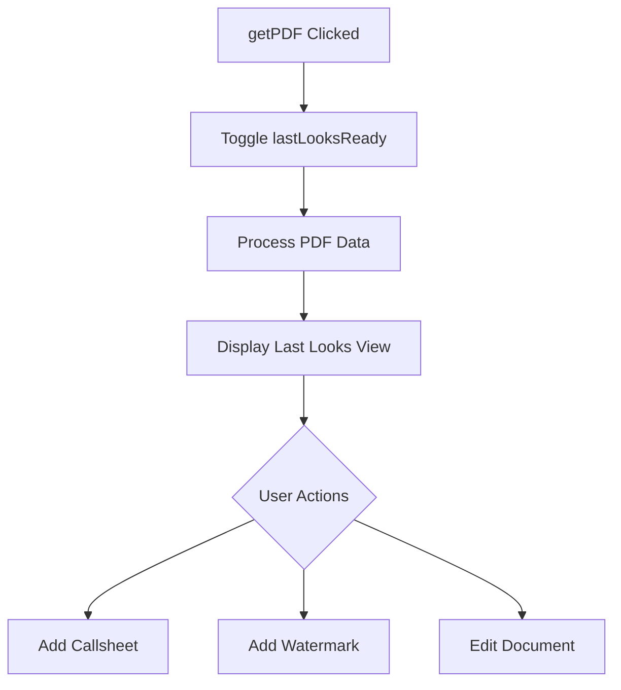

# DashboardRight Component Documentation

## Overview
DashboardRight serves as the main container for script processing, handling two primary stages:
1. Scene Selection
2. Last Looks (Final Proofing)

## Component States

### Primary State Flags
```typescript
dataReady: boolean        // Initial data loading complete
active: boolean          // Scene selection is active
waitingForScript: boolean // Processing in progress
finalDocReady: boolean   // Document ready for final steps
lastLooksReady: boolean  // Last Looks mode active
callsheetReady: boolean  // Call sheet has been processed
linesReady: boolean      // Line processing complete
waterMarkState: boolean  // Watermark has been added
```

## Flow Stages

### 1. Scene Selection Stage


### 2. Last Looks Stage


## Key Methods

### Stage Management
```typescript
toggleLastLooks(): void {
  // Switches between scene selection and last looks
  // Processes PDF data when entering last looks
}

prepFinalDocument(addCallSheet: boolean): void {
  // Prepares document for final processing
  // Handles call sheet integration
}
```

### Authentication Flow
```typescript
async handleAuthAction() {
  // Manages auth flow before document processing
  // Handles both sign-in and purchase confirmation
}

async handleSignOut() {
  // Manages sign-out process
}
```

### Document Processing
```typescript
sendFinalDocumentToServer(finalDocument): Promise<void> {
  // Handles final document submission
  // Manages subscription checks
  // Handles payment flow if needed
}
```

## UI Template Structure

### Main Layout
```
Dashboard Right
├── Scene Selection View (when !lastLooksReady)
│   ├── Data Feed (Left Panel)
│   │   ├── Scene Search
│   │   └── Scene Table
│   └── Control Panel (Right Panel)
│       ├── Script Info
│       ├── Selected Scenes
│       └── Control Buttons
└── Last Looks View (when lastLooksReady)
    ├── Document Preview
    ├── Editing Tools
    └── Final Controls
```

### Key Template Features
1. Responsive Design:
   - Flex layout for desktop/mobile
   - Collapsible panels
   - Adaptive table view

2. User Controls:
   - Scene selection table
   - Document preview
   - Edit controls
   - Authentication buttons

## State Management Flow

### Scene Selection
1. Initial State:
```typescript
{
  lastLooksReady: false,
  dataReady: true,
  selected: []
}
```

2. After Scene Selection:
```typescript
{
  selected: [/* selected scenes */],
  lastLooksReady: false,
  finalDocument: {
    doc: {},
    breaks: {}
  }
}
```

3. Last Looks Mode:
```typescript
{
  lastLooksReady: true,
  finalPdfData: {
    selected: [/* scenes */],
    script: string,
    individualPages: number,
    callsheet: string,
    waitingForScript: boolean
  }
}
```

## Error Handling

### Key Error Scenarios
1. Missing Script Data:
   - Redirects to upload
   - Shows alert

2. Authentication Errors:
   - Opens login dialog
   - Preserves document state

3. Processing Errors:
   - Shows error dialog
   - Offers retry options

## Integration Points

### Services
- UploadService: Document processing
- PdfService: PDF generation
- AuthService: Authentication
- StripeService: Payment processing
- UndoService: Edit history

### External Components
- LastLooksComponent
- SpinningBotComponent
- IssueComponent
- AddCallsheetComponent
- AddWatermarkComponent

## Usage Example

```typescript
// In template
<app-dashboard-right>
  <ng-container *ngIf="!lastLooksReady">
    <!-- Scene Selection View -->
  </ng-container>
  <ng-container *ngIf="lastLooksReady">
    <!-- Last Looks View -->
  </ng-container>
</app-dashboard-right>
```

## Security Considerations
1. Authentication State:
   - Checks before sensitive operations
   - Maintains user context
   - Handles token expiration

2. Document Access:
   - Validates user permissions
   - Checks subscription status
   - Secures document tokens