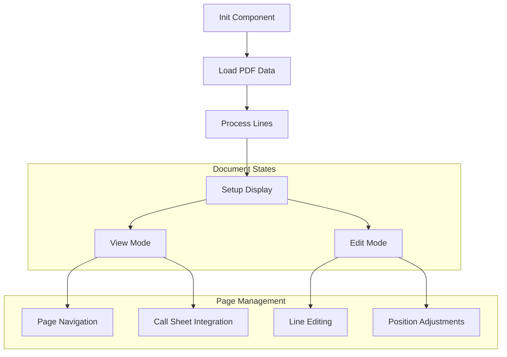

# LastLooks Component Documentation

## Overview
LastLooks is a child component of DashboardRight that provides the final preview and editing functionality for processed script documents. It handles page navigation, line adjustments, and call sheet integration.

## Component Flow



## Component Properties

### Inputs
```typescript
@Input() editState: boolean;            // Controls edit mode
@Input() resetDocState: string;         // Triggers document reset
@Input() selectedLineState: string;     // Current selected line state
@Input() undoState: string;             // Triggers undo action
@Input() callsheetPath: string | null;  // Path to call sheet
```

### Outputs
```typescript
@Output() selectedEditFunctionChange: EventEmitter<string>;
@Output() pageUpdate: EventEmitter<Line[]>;
```

## Key Features

### 1. Page Navigation
```typescript
previousPage() {
    if (this.currentPageIndex > 0) {
        this.currentPageIndex--;
        this.updateDisplayedPage();
    }
}

nextPage() {
    if (this.currentPageIndex < this.doc.length) {
        this.currentPageIndex++;
        this.updateDisplayedPage();
    }
}
```

### 2. Line Processing
```typescript
processLinesForLastLooks(arr) {
    arr.forEach((page) => {
        page.forEach((line) => {
            this.adjustSceneNumberPosition(line);
            this.adjustBarPosition(line);
            this.calculateYPositions(line);
            // Calculate display positions
            line.calculatedXpos = Number(line.xPos) * 1.3 + 'px';
            line.calculatedEnd = Number(line.yPos) > 90 ? 
                Number(line.yPos) * 1.3 + 'px' : '90px';
        });
    });
}
```

### 3. Call Sheet Management
```typescript
private insertCallsheetPage(imagePath: string) {
    const callsheetPage: CallsheetPage = {
        type: 'callsheet',
        imagePath: imagePath
    };
    
    // Remove existing and add new
    this.pages = this.pages.filter(page => 
        !(page as any).type || (page as any).type !== 'callsheet');
    this.pages.unshift(callsheetPage);
    this.hasCallsheet = true;
}
```

## State Management

### Document State
```typescript
doc: any;                      // Current document
pages: any[];                  // Document pages
initialDocState: any[];        // Original document state
currentPageIndex: number = 0;  // Current page
currentPage: any = 0;         // Current page content
```

### Edit State
```typescript
canEditDocument: boolean = false;
selectedEditFunction: string = 'toggleSelected';
selectedLine: Line | null = null;
```

## Line Processing Rules

### Position Calculations
```typescript
adjustYpositionAndReturnString(lineYPos: number): string {
    return Number(lineYPos) > 1 ? 
        Number(lineYPos) * 1.3 + 'px' : '0';
}

calculateYPositions(line: Line) {
    line.calculatedYpos = 
        this.adjustYpositionAndReturnString(line.yPos);
}
```

### Scene Numbers
```typescript
adjustSceneNumberPosition(line: Line) {
    if ((line.category === 'scene-number-left' || 
         line.category === 'scene-number-right') && 
         line.trueScene === 'true-scene') {
        line.calculatedYpos = line.yPos - 10;
    }
}
```

## Integration Points

### 1. PDF Service Integration
- Receives formatted document data
- Handles document state management
- Processes line positions

### 2. Drag-Drop Service
- Handles line repositioning
- Manages edit mode interactions

### 3. Undo Service
- Manages document state history
- Handles undo/redo operations

## Error Handling & Validation

### Document Validation
```typescript
ngOnInit(): void {
    if (this.pdf.finalDocument?.data) {
        this.doc = this.pdf.finalDocument.data;
        this.pages = this.doc;
        this.currentPage = this.pages[this.currentPageIndex] || [];
    } else {
        console.error('No document data available');
    }
}
```

### State Recovery
```typescript
resetDocumentToInitialState() {
    this.undoService.reset();
    this.doc = this.initialDocState;
    this.processLinesForLastLooks(this.pages);
}
```

## Usage Example

```typescript
// In parent component template
<app-last-looks
    [editState]="editMode"
    [resetDocState]="resetState"
    [callsheetPath]="callsheetUrl"
    (pageUpdate)="handlePageUpdate($event)"
>
</app-last-looks>
```

## Line Categories for First Line
```typescript
acceptableCategoriesForFirstLine = [
    'dialog',
    'character',
    'description',
    'first-description',
    'scene-header',
    'short-dialog',
    'parenthetical',
    'more',
    'shot'
];
```

Would you like me to elaborate on any specific aspect of the LastLooks component?