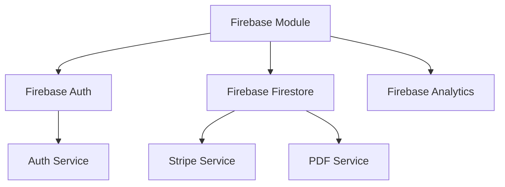
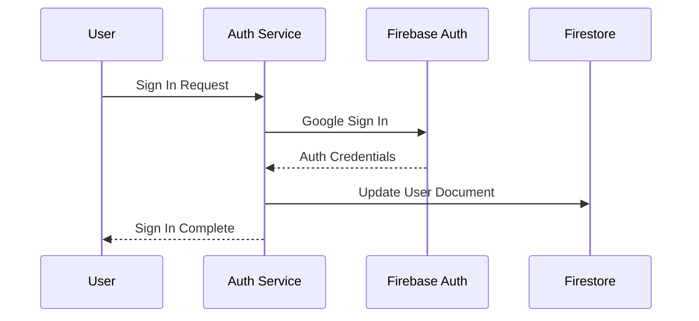

# Firebase Integration Documentation

## Architecture Overview



## Module Setup

### Firebase Module Configuration
```typescript
// firebase.module.ts
@NgModule({
  imports: [
    provideFirebaseApp(() => initializeApp(firebaseConfig)),
    provideAnalytics(() => getAnalytics()),
    provideFirestore(() => getFirestore()),
    provideAuth(() => getAuth()),
  ]
})
```

## Database Collections

### Users Collection
```typescript
interface UserDocument {
  uid: string;
  email: string;
  displayName: string;
  createdAt: Timestamp;
  lastLogin: Timestamp;
}

// Collection: 'users/{userId}'
```

### Subscriptions Collection
```typescript
interface SubscriptionDocument {
  userId: string;
  stripeCustomerId: string;
  stripeSubscriptionId: string;
  status: 'pending' | 'active' | 'canceled' | 'past_due';
  currentPeriodStart: Timestamp;
  currentPeriodEnd: Timestamp;
}

// Collection: 'subscriptions/{userId}'
```

### Usage Collection
```typescript
interface UsageDocument {
  userId: string;
  pdfsGenerated: number;
  scriptsProcessed: number;
  storageUsed: number;
  lastUpdated: Timestamp;
}

// Collection: 'usage/{userId}'
```

## Service Integration

### Auth Service
```typescript
@Injectable()
class AuthService {
  user$ = this.auth.authState;  // Firebase Auth State Observable

  constructor(
    private auth: Auth,
    private firestore: Firestore
  ) {}

  // User operations flow through Firebase Auth
  async signIn() {...}
  async signOut() {...}
  async deleteAccount() {...}
}
```

### Stripe Service
```typescript
@Injectable()
class StripeService {
  constructor(private firestore: Firestore) {}

  // Subscription data stored in Firestore
  getSubscriptionStatus(uid: string) {
    return this.firestore
      .collection('subscriptions')
      .doc(uid)
      .valueChanges();
  }
}
```

## Authentication Flow



## Data Access Patterns

### User Profile
```typescript
// Accessing user profile data
this.firestore
  .collection('users')
  .doc(userId)
  .valueChanges()
  .subscribe(userData => {...});
```

### Subscription Status
```typescript
// Checking subscription status
this.firestore
  .collection('subscriptions')
  .doc(userId)
  .valueChanges()
  .subscribe(subData => {...});
```

## Security Rules

```javascript
// Firestore security rules
rules_version = '2';
service cloud.firestore {
  match /databases/{database}/documents {
    // User document rules
    match /users/{userId} {
      allow read: if request.auth != null && request.auth.uid == userId;
      allow write: if request.auth != null && request.auth.uid == userId;
    }
    
    // Subscription rules
    match /subscriptions/{userId} {
      allow read: if request.auth != null && request.auth.uid == userId;
      allow write: if false;  // Only server can write
    }
  }
}
```

## Analytics Integration

```typescript
// Track user events
const analytics = getAnalytics();
logEvent(analytics, 'user_action', {
  userId: user.uid,
  action: 'generate_pdf'
});
```

## Environment Configuration

```typescript
// environment.ts
export const environment = {
  production: false,
  firebaseConfig: {
    apiKey: '...',
    authDomain: '...',
    projectId: '...',
    // ... other Firebase config
  }
};
```

## Error Handling

```typescript
try {
  await this.auth.signIn();
} catch (error) {
  if (error.code === 'auth/user-not-found') {
    // Handle auth errors
  } else if (error.code === 'firestore/permission-denied') {
    // Handle database errors
  }
}
```

## Important Notes
1. All user data is stored in Firestore
2. Authentication is handled by Firebase Auth
3. Analytics events are tracked through Firebase Analytics
4. Security rules protect data access
5. Environment configurations manage Firebase setup

Would you like me to elaborate on any specific aspect of the Firebase integration?