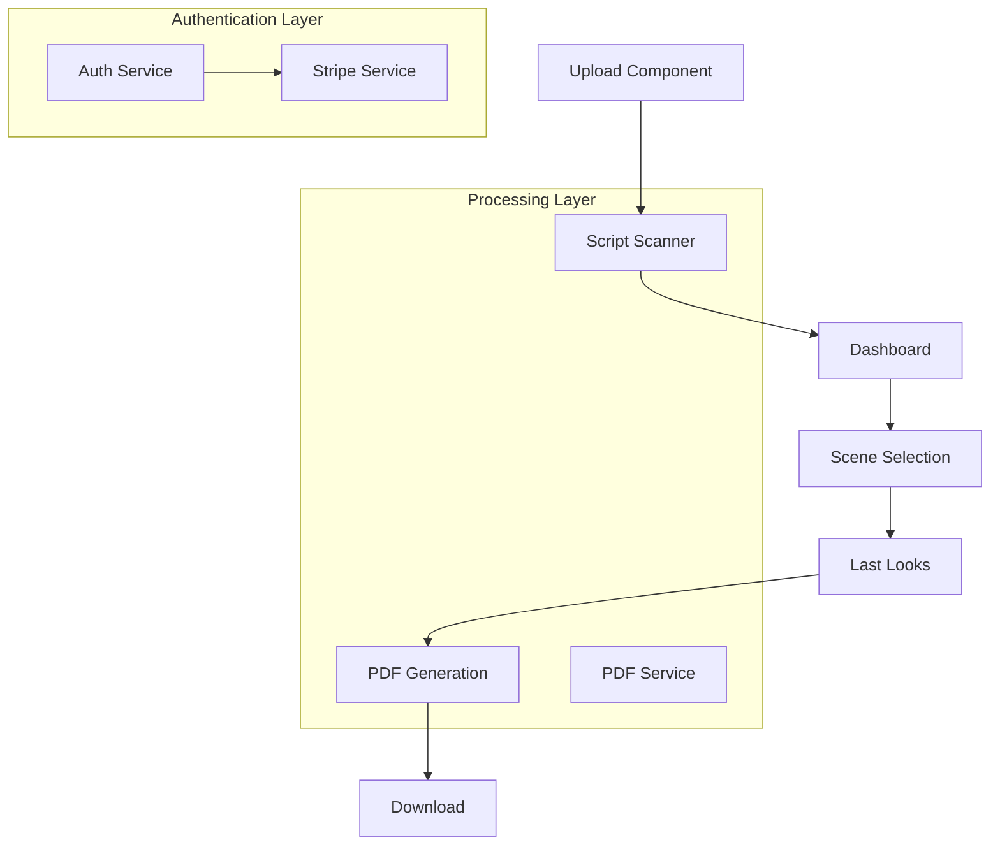
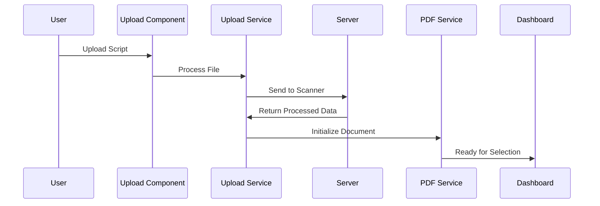
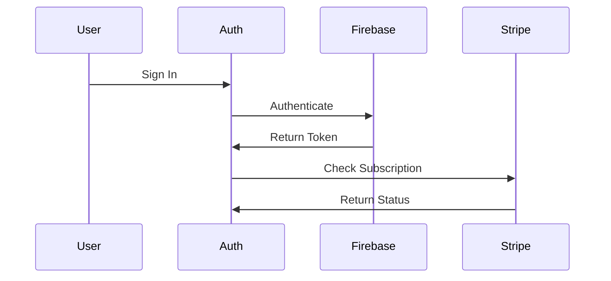

# Script Processing Application Architecture

## High-Level Flow



## Core Flow Stages

### 1. Initial Upload


### 2. Document Processing Pipeline

#### Stage 1: Upload & Scan
- **Upload Component**
  - Handles file selection
  - Initial validation
  - Progress tracking
  
- **Server Processing**
  - Script scanning
  - Line classification
  - Page organization
  - Scene detection

#### Stage 2: Dashboard & Selection
- **Dashboard Left**
  - Displays scene list
  - Enables scene selection
  - Shows script metadata

- **Dashboard Right**
  - Preview selected scenes
  - Manage selection state
  - Trigger PDF generation

#### Stage 3: Last Looks
- **Document Preview**
  - Page-by-page review
  - Line adjustments
  - Position tweaking

- **Document Finalization**
  - Call sheet integration
  - Watermark addition
  - Final formatting

## Service Architecture

### Core Services

1. **Upload Service**
```typescript
class UploadService {
    // File handling
    postFile(file: File): Observable<any>
    
    // PDF Generation
    generatePdf(document: any): Observable<PdfResponse>
    
    // State Management
    allLines: Line[]
    individualPages: any[]
}
```

2. **PDF Service**
```typescript
class PdfService {
    // Document Processing
    processPdf(scenes, name, pages, callsheet?)
    
    // Line Management
    processLines(merged, breaks)
    
    // State
    finalDocument: any
    finalDocReady: boolean
}
```

3. **Stripe Service**
```typescript
class StripeService {
    // Subscription Management
    createSubscription(userId: string)
    getSubscriptionStatus(uid: string)
    
    // Checkout
    startCheckout(expirationTime, jwtToken, downloadTimeRemaining)
}
```

## Component Hierarchy

```
App
├── Auth Components
│   ├── Login
│   └── Profile
├── Upload
│   ├── File Selection
│   └── Progress Tracking
├── Dashboard
│   ├── Left Panel (Scene Selection)
│   └── Right Panel (Preview/Last Looks)
└── Complete
    └── Download
```

## Data Flow

### 1. Script Processing Flow
```typescript
interface ProcessingFlow {
    upload: {
        input: File,
        output: ProcessedScript
    },
    selection: {
        input: ProcessedScript,
        output: SelectedScenes
    },
    lastLooks: {
        input: SelectedScenes,
        output: FinalDocument
    }
}
```

### 2. Document States

```typescript
interface DocumentStates {
    raw: File,
    processed: {
        allLines: Line[],
        scenes: Scene[],
        pages: Page[]
    },
    selected: {
        scenes: Scene[],
        metadata: ScriptMetadata
    },
    final: {
        pages: FinalPage[],
        callsheet?: string,
        watermark?: string
    }
}
```

## Key Features Implementation

### 1. Scene Selection
- Table-based selection interface
- Preview capability
- Scene metadata display

### 2. Document Preview
- Page navigation
- Line editing
- Position adjustment

### 3. Final Processing
- Call sheet integration
- Watermark application
- Subscription validation

## Authentication & Authorization

### 1. User Flow


### 2. Subscription States
```typescript
enum SubscriptionStatus {
    NONE = 'none',
    PENDING = 'pending',
    ACTIVE = 'active',
    PAST_DUE = 'past_due'
}
```

## Error Handling

### 1. Upload Errors
- File type validation
- Size limitations
- Processing failures

### 2. Processing Errors
- Scene detection issues
- Line classification errors
- Page break problems

### 3. Authentication Errors
- Token expiration
- Subscription issues
- Authorization failures

## Future Considerations

1. **Performance Optimizations**
   - Worker implementation for processing
   - Caching strategies
   - Lazy loading improvements

2. **Feature Enhancements**
   - Batch processing
   - Advanced editing tools
   - Collaboration features

3. **Technical Debt**
   - Type improvements
   - Service splitting
   - Component refactoring

Would you like me to elaborate on any particular aspect of the architecture?