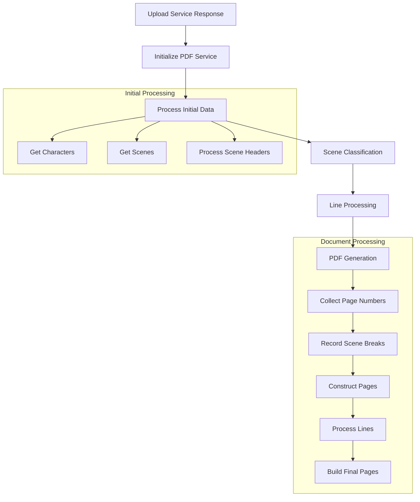
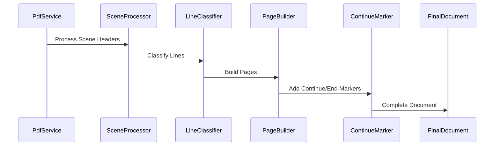

# PDF Service Documentation

## Overview
The PdfService is responsible for processing, classifying, and managing script documents after they've been initially processed by the UploadService. It handles scene breakdown, line classification, and final PDF preparation.

## Data Flow



## Core Responsibilities

### 1. Initial Data Processing
```typescript
initializeData() {
  // Processes initial script data from upload service
  // Sets up character and scene data
  // Initializes document state
}
```

### 2. Scene Management
- Scene identification
- Scene break tracking
- Scene header processing
- Line visibility management

### 3. Line Processing
```typescript
processLines(merged: Line[], breaks: SceneBreak[]) {
  // Process each line in the document
  // Apply visibility rules
  // Handle special cases (scene headers, last lines)
  // Manage continue/end markers
}
```

## Key State Properties

### Document Structure
```typescript
finalDocument = {
  data: Line[][],        // Pages of lines
  name: string,          // Document name
  numPages: number,      // Total pages
  callSheetPath: string  // Optional call sheet
}
```

### Line Categories
```typescript
LINE_TYPES = [
  'dialog',
  'character',
  'description',
  'scene-header',
  'parenthetical',
  // ... other types
]
```

## Processing Stages

### 1. Scene Processing


### 2. Line Visibility Rules
- Scene headers trigger visibility for their scenes
- Continue markers for page breaks
- End markers for scene endings
- Special handling for page numbers

### 3. Page Construction
```typescript
buildFinalPages(processedLines: Line[]) {
  // Group lines by page
  // Apply page-specific formatting
  // Handle page breaks
  // Add continue/end markers
}
```

## Special Features

### 1. Scene Header Processing
```typescript
processSceneHeader(lineInDataTable, lineInScript) {
  // Handles complex scene number patterns
  // Example: "86B-86COMITTED86B-86C"
  // Extracts scene numbers and content
}
```

### 2. Continue/End Markers
- Automatically adds CONTINUE markers between pages
- Handles END markers for scene breaks
- Special cases for page breaks

### 3. Watermark Support
```typescript
watermarkPages(watermark: string, doc: Document) {
  // Adds watermark to each page
  // First line of each page gets watermark
}
```

## Usage Example

```typescript
// In a component
constructor(private pdfService: PdfService) {}

processPdfDocument(sceneArr, name, pages, callsheet?) {
  this.pdfService.processPdf(sceneArr, name, pages, callsheet);
  // Returns processed document ready for display
}
```

## Integration Points

### 1. Upload Service
- Receives initial script data
- Gets character and scene information

### 2. Line Service
- Line classification
- Line visibility rules
- Special line handling

### 3. Document Display
- Provides formatted data for display
- Manages page breaks and continue markers
- Handles scene boundaries

## Error Handling

### Common Issues
1. Missing scene breaks
2. Invalid line categories
3. Page number mismatches
4. Scene header parsing errors

### Prevention Strategies
1. Data validation
2. Fallback categories
3. Scene number normalization
4. Page number verification

## State Management
The service maintains several important states:
```typescript
finalPdfData: any;          // Final processed document
allLines: Line[];           // All script lines
scenes: Scene[];            // Processed scenes
finalDocReady: boolean;     // Document ready state
watermark: string;          // Optional watermark
initialFinalDocState: any;  // Initial state for undo
```

This service is central to the document processing pipeline, handling the complex transformation from raw script data to a formatted, displayable PDF document.

Would you like me to elaborate on any particular aspect of the service?