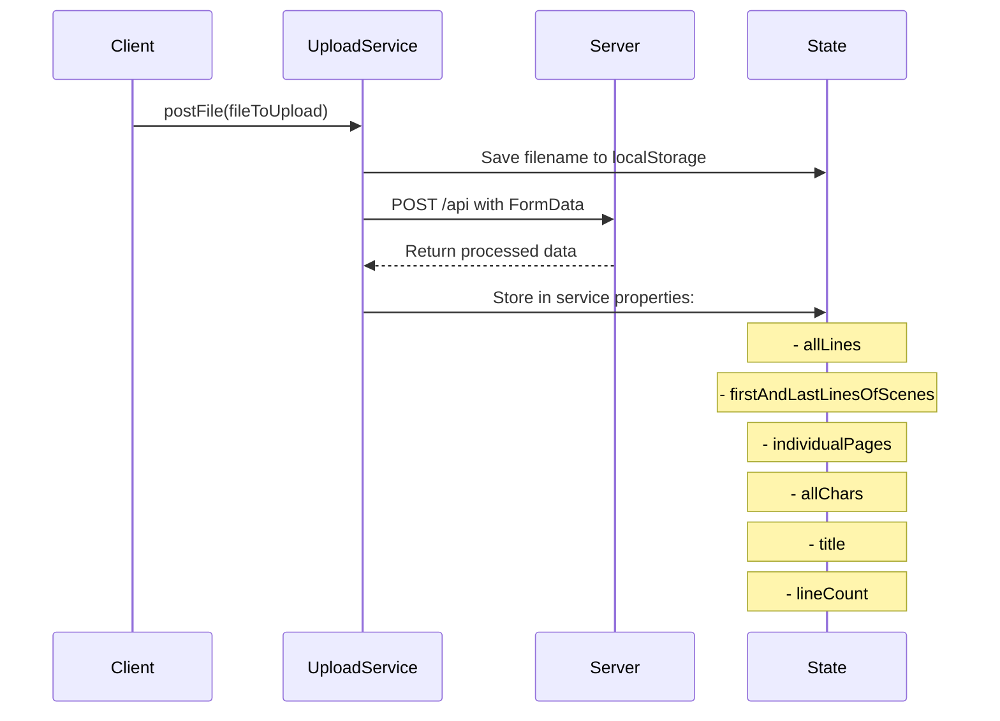
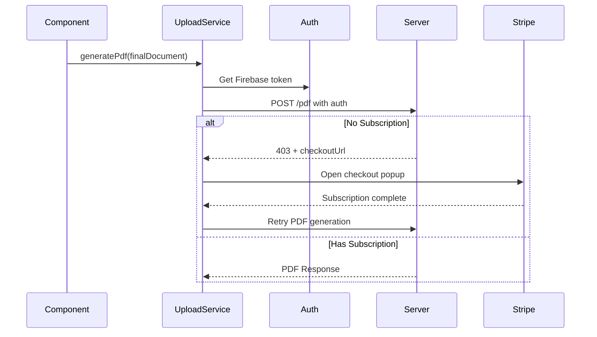

# UploadService Documentation

## Core Responsibilities
1. Script Upload & Processing
2. Call Sheet Management
3. PDF Generation & Subscription Handling
4. State Management for Script Data

## Data Flow

### 1. Initial Script Upload


### 2. Script Processing Flow
The service maintains several key pieces of state after processing:
- `allLines`: Complete script line data
- `individualPages`: Script broken into pages
- `allChars`: Character tracking
- `firstAndLastLinesOfScenes`: Scene boundary tracking
- `lineCount`: Line counts per page

### 3. PDF Generation Flow


## Key Methods

### `postFile(fileToUpload: File)`
Primary method for uploading and processing scripts:
- Creates FormData with script file
- Sends to server for processing
- Stores processed data in service state
- Returns Observable with processed data

### `generatePdf(finalDocument)`
Handles PDF generation with subscription checks:
- Authenticates request with Firebase token
- Handles subscription redirects if needed
- Manages Stripe checkout popup flow
- Returns Observable with PDF generation response

### `postCallSheet(fileToUpload: File)`
Manages call sheet uploads:
- Separate flow from main script upload
- Stores call sheet state
- Returns Observable with call sheet response

### `handleSubscriptionFlow()`
Manages subscription process:
- Opens Stripe checkout in popup
- Monitors popup state
- Verifies subscription completion
- Retries PDF generation after successful subscription

## Error Handling
- Comprehensive error handling through `handleError` method
- Custom error messages for different scenarios:
  - Network issues
  - Authentication errors
  - Permission issues
  - Server errors

## State Management
The service maintains several important state properties:
```typescript
script: string;                     // Current script name
allLines: Line[];                   // All script lines
lineCount: any[];                   // Lines per page
individualPages: any[];             // Page breakdown
allChars: any[];                   // Character data
firstAndLastLinesOfScenes: any[];   // Scene boundaries
title: string;                      // Script title
coverSheet: any;                    // Call sheet data
```

## Integration Points
1. **Authentication**
   - Firebase authentication integration
   - Token management for requests

2. **Server Endpoints**
   - `/api` - Script processing
   - `/pdf` - PDF generation
   - `/callsheet` - Call sheet upload
   - `/delete` - Document deletion

3. **Subscription Management**
   - Stripe integration
   - Subscription status checking
   - Checkout flow handling

## Usage Example
```typescript
// In a component
constructor(private uploadService: UploadService) {}

async handleFileUpload(event: any) {
  const file: File = event.target.files[0];
  
  this.uploadService.postFile(file).subscribe({
    next: (processedData) => {
      // Handle processed script data
    },
    error: (error) => {
      // Handle upload error
    }
  });
}
```